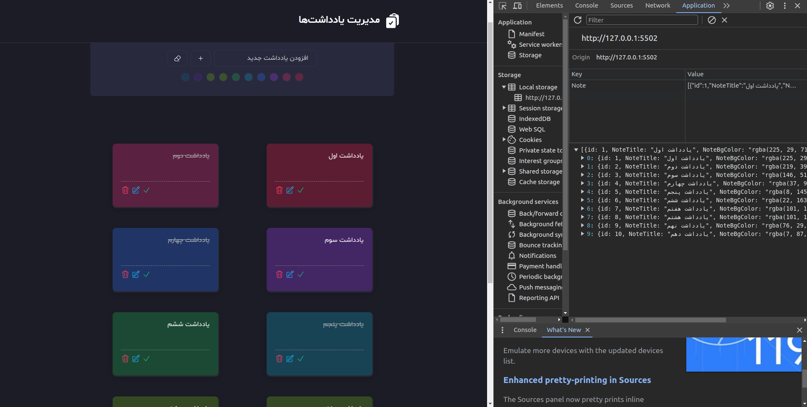

  <a href="#">
    <h2 align="center">Note App | مدیریت یادداشت‌ها</h2>
  </a>

# App Preview

---

Develop with JS

# APP Features
<ul>
<li>You can add new note with enter and click plus button</li>
<li>Your notes will <strong>not be deleted after the refresh</strong>, and if you visit the app again, you will have access to all of them</li>
<li>You can choose different</li>
<li>You can mark the note as done if it is a task<li>
<li>You can see the alert in the app header after each operation edit note text and color</li>
<li>You can delete one note</li>
<li>You can delete all notes</li>
<li>You cal scroll top with one click</li>
</ul>

<strong>Enjoy the app</strong>

---

Made with :heart: by Ghorbani-Dev1985
